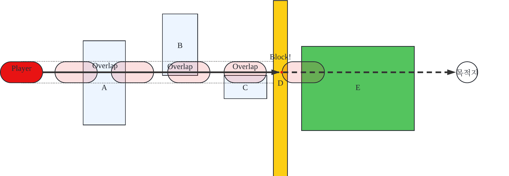

# 콜리션 사용법

## 용어 정리

### 충돌 타입 별 상호작용
| 충돌 타입 | Ignore | Overlap | Block |
| --------- | ------- | ------- | ----- |
| Ignore		| Ignore	| Ignore	| Ignore|
| Overlap		| Ignore	|	*Overlap* | *Overlap* |
| Block			|	Ignore	| *Overlap* | **Block** |

* **Hit**: 두 오브젝트가 서로를 **Block** 할 때, **Hit** 했다고 합니다. (**Block** = **Hit**)
* **Overlap**: 두 오브젝트 둘 다 **Ignore**이 아니면서 둘 중 하나가 **Overlap** 일 때 서로 겹치면, **Overlap** 했다고 합니다.

### 오브젝트 충돌 체크 방식
* Check **Trace**: 레이 캐스팅을 통해 라인(Line)과 오브젝트의 충돌을 체크합니다 (아직 구현 안됨).
* Check **Sweep**: 말 그대로 시작점부터 끝점까지 지역을 훑고 지나갑니다. 물리연산이 켜져야만 Sweep을 통해 콜리션을 체크합니다. ***또한,
물리연산이 켜져 있을 때만 (=Sweep이 가능 할 때에만) Block이 가능합니다.***
* Check **Overlap**: 현재 포지션에서 다른 오브젝트와 겹쳐져 있는지 확인합니다. 

### 충돌 속성 (CollisionProperty)
충돌 속성은 다음의 정보들을 나타냅니다.
#### 1. 충돌 가능 여부
```cpp
// 충돌 가능 여부를 나타냅니다
// CollisionEnabled::NoCollision이면 충돌을 하지 않습니다.
// CollisionEnabled::EnableCollision이면 충돌을 합니다.
CollisionEnabled::Type collisionEnabled	
```

#### 2. 오브젝트의 충돌 타입
```cpp
// 오브젝트의 충돌 채널을 나타냅니다.
// 충돌 채널을 변경하기 위해선 엔진 사이드에서 직접 변경해야 합니다.
// ECollisionChannel의 구성은 다음과 같습니다.
// typedef enum ECollisionChannel 
// {
//	Camera,
//	WorldStatic,
//	WorldDynamic,
//	Pawn,
//	Character,
//	ProjectTile,
//	...,
//	NUM_COLLISION_CHANNELS
// };
//
ECollisionChannel objectType

```

#### 3. 충돌 채널에 따른 반응 테이블
```cpp

// 말그대로 충돌 채널 별 오브젝트가 어떻게 반응할지 저장합니다.
// 충돌 반응(CollisionResponse)에는 다음의 세 가지가 있습니다.
//	Ignore, Overlap, Block
CollisionResponseContainer responseContainer;
```

#### * 충돌 정보 프리셋 **

`enum class CollsionPropertyPreset{...}`을 통해 미리 설정된 `CollisionProperty` 값을 불러올 수 있습니다.

예를 들어, `CollisionProperty`를 생성할 때, 다음의 구문을 통해 오브젝트를 `WorldStatic` 충돌 타입으로 만들고, 
모든 채널에 대해서 `Block` 할 수 있습니다.

```cpp
CollisionProperty collisionProperty{ CollisionPropertyPreset::BlockAll };
```

***`CollisionPropertyPreset`은 게임 세팅 시, 엔진 사이드에서 직접 변경해야 합니다.***

## PrimitiveComponent 에서의 충돌 구현
`PrimitiveComponent` 클래스 안에는 다음의 충돌과 관련된 맴버 변수들이 존재합니다.

* `bSimulatePhysics`: `bool`
	*	기본값: `false`
	* 설명: `true`면 오브젝트를 움직일 때 물리 연산을 적용합니다. 물리 연산이 적용되어야만 `block`이 가능해집니다.
* `bCanCollide`: `bool`
	* 기본값: `false`
	* 설명: `true`면 충돌이 가능합니다. `false`는 그 반대.
*	`bGenerateOverlapEvent`: `bool`
	* 기본값: `false`
	* 설명: `true`면 오버랩 시 이벤트를 발생시킵니다. `false`는 그 반대.
*	`collisionProperty`: `CollisionProperty`
	* 기본값: `CollsionPropertyPreset::NoCollision`
	* 설명: 충돌 속성을 저장합니다.

다만 `PrimitiveComponent` 자체는 충돌체와 물리 움직임을 구현하기 위한 뼈대 역할 이므로, `PrimitiveComponent`를 가지고 
충돌체 세팅을 하는 것은 불가능 합니다. 예를 들어, 충돌체 정보를 넘길 때에 `CollisionShape`라는 구조체를 통해서 본인의 충돌체
모형 정보를 전달하는데, 이때 `GetCollisionShape()` 함수를 사용해야 합니다. 그러나, `PrimitiveComponent`의 기본 가상함수인 
`GetCollisionShape()`를 사용하여 충돌체 정보를 반환하면, `Invalid` 된 상태의 `CollisionShape`이 전달 되므로 충돌 처리가 무시됩니다.

따라서, 충돌체를 만들기 위해서는 `PrimitiveComponent`를 상속받은 다른 구체화된 컴포넌트들을 사용해야합니다.
이러한 이유로, 사용자가 충돌체 구현을 하기 위해서는 `ShapeComponent`를 상속받은 다른 컴포넌트들을 사용해야 하는데,
이는 `ShapeComponent` 컴포넌트 인터페이스가 `PrimitiveComponent`를 상속받아 번거로운 충돌체 속성을 세팅해주기 때문입니다.

`ShapeComponent`를 상속받은 컴포넌트들로는 
* `BoxComponent`
* `CapsuleComponent`
* `CircleComponent`
* `PolygonComponent`

가 있습니다. 

### PrimitiveComponent 에서의 충돌 처리 프로세스

모든 충돌 처리는 오브젝트가 움직일 때 발생합니다. 움직이지 않는 오브젝트는 충돌처리를 하지 않습니다.
따라서, 충돌 처리 프로세스는 컴포넌트의 속도를 증가시키거나, 회전 속력을 증가시키는 등의 이벤트가 발생할 경우에만 적용됩니다.

컴포넌트의 속력에 영향을 주는 함수들은 다음과 같습니다.

* `void TeleportComponent(Math::Vector2 _teleportDelta)`
* `void SetComponentVelocity(Math::Vector2 _velocity)`
* `void AddComponentVelocity(Math::Vector2 _velocity)`
* `void SetComponentAngularVelocity(float _angularVelocity)`
* `void AddComponentAngularVelocity(float _angularVelocity)`

~~***여기서 알아 두어야 할 점은, `Translate()` 혹은 `Rotate()` 등의 함수를 통해 직접 컴포넌트의 위치를 바꾸게 되면, 충돌 처리가
일어나지 않는다는 것입니다. 모든 충돌처리 프로세스는 `PrimitiveComponent` 안에 구현되어있기 때문에, 그의 상위 함수들인 
`Translate()` 같은 함수를 사용하여 컴포넌트를 움직이게 되면, 그 하위 클래스들에서 구현된 `MoveComponent` 함수는 컴포넌트의
이동을 알아 차릴 수 없습니다. 그러므로, 컴포넌트의 충돌 처리 프로세스를 작동시키기 위해선 컴포넌트의 속력을 변화시키거나, 
혹은 물리가 적용된 경우 `AddForce()` 함수를 통해 컴포넌트를 움직여야 합니다.***~~

***Update***<br>
이제 `Translate()`이나 `Rotate()` 함수를 사용해도 충돌 처리가 일어납니다.

***

컴포넌트의 충돌처리 프로세스는 기본적으로 같은 흐름이지만, 물리가 적용된 경우에는 `Sweep`을 통해서 이동하는 반면, 물리가 적용되지
않은 경우에는 `Teleport`를 통해 이동하는다는 점에서 크게 차이가 있습니다.

#### 물리가 적용된 경우

먼저 물리가 적용된 경우, `Sweep`을 통해 물체가 전진합니다. `Sweep`은 말 그대로 본인의 현재 위치에서 목적지까지 진행하는 방향을
조금씩 조금씩 전진하면서 매 스텝마다 충돌체크를 진행합니다.

예를 들어, 아래의 그림과 같이, 오브젝트가 현재 위치에서 화살표 방향으로 `Sweep`을 통해 이동하게 되면, 진행 방향의 중간에 있는 
모든 오브젝트들 (A, B, 그리고 C) 과의 오버랩 상호작용이 가능해 집니다. 또한, D 오브젝트와의 'Block' 상호작용을 통해, Hit 이벤트 발생이 가능해 지며,
이를 통한 충돌 이후의 위치값 조정이 가능해 집니다. 마지막으로, D 와의 충돌 이후 E 오브젝트에는 닿을 수 없기 때문에 `Sweep` 도중 Overlap이 감지 되었더라도 
(그림에서 Player 오브젝트 Sweep 테스트 중, D의 충돌과 E의 Overlap은 동시에 감지 됩니다) E의 상호작용은 거리값 정렬 과정에 의해 제외 됩니다.
요약하자면, `Sweep` 테스트를 사용하면 본인이 현재 위치에서 목적지까지의 사이에 있는 오브젝트들과 정교한 연산이 가능하며, 이에 더해, Hit 충돌 처리가 
가능합니다.



이 방식의 장점은 정교한 `Overlap`과 `Hit` 체크가 가능하다는 점이지만, 단점은 그만큼 연산량이 많아진다는 것입니다. 따라서, 게임
월드 안에 많은 물체가 물리연산을 통해 이동할 경우 게임의 프레임이 크게 감소할 수 있습니다.

(이러한 이유로, 'Memorize' 에서는 주인공만 물리연산을 적용하여 벽과의 충돌을 구현하고, 나머지 이동가능한 오브젝트들은 물리연산을 
적용하지 않아야 합니다.)

#### 물리가 적용되지 *않은* 경우

물리가 적용되지 않은 경우, 물체가 `Teleport`를 통해 입력된 속력의 델타 만큼 바로 이동합니다. 이 경우, `Sweep` 방식과 다르게, 이동거리 중간에 있는
오브젝트들과의 상호작용은 무시된 채, `Teleport` 된 위치에서 바로 Overlap 테스트를 진행합니다. 
이 방식의 장점은 `Sweep` 테스트에 비해 연산량이 적다는 것이지만, 그만큼 정교한 계산은 불가능하기 때문에, 도형 간의 정확한 위치값 계산이 
필요한 `Hit` 이벤트를 발생시키지 않습니다. 다시 말해, 물리가 적용되지 않은 오브젝트는 `Block` 이벤트를 발생시키지 않습니다.

***

다음으로 충돌 처리가 일어났을 때, 발생하는 이벤트에는 세 가지 종류가 있습니다.

첫 번째는, `BeginOverlap`이며 두 물체 간 Overlap이 처음으로 시작된 프레임에 발생합니다.

두 번째는, `EndOverlap`입니다. `EndOverlap` 이벤트는 두 물체가 더 이상 겹쳐있지 않게 되면 발생합니다.

세 번째는, `Hit` 입니다. `Hit`는 ***서로를 `Block` 하는 두 물체*** 중에 ***한 물체라도 물리가 적용된 상태***에서 충돌 했을 때 발생하며, 
이벤트 발생 이후 두 물체의 'Collision Resolve' 프로세스에 의해 겹칩이 발생하지 않습니다.

충돌 이벤트를 발생 시키기 위해서는 다음의 조건을 만족해야 합니다.

#### Overlap 이벤트 발생 시
* 두 물체 모두 충돌이 가능해야 합니다. (`SetCollisionEnabled(CollisionEnabled::EnableCollision)` 함수 호출을 통해 충돌을 가능하게 할 수 있습니다.)
* 두 물체 모두 서로의 충돌 채널에 대한 반응 (Collision Response) 이 둘 다 Overlap 이거나, 둘 중 하나가 Block 이어야 합니다.
* 두 물체 모두 `bGenerateOverlapEvent` 가 `true` 이어야 합니다.

#### Hit 이벤트 발생 시
* 두 물체 모두 충돌이 가능해야 합니다.
* 두 물체 모두 서로의 충돌 채널에 대한 반응이 둘 다 Block 이어야 합니다.
* 두 물체 중 최소 한 개의 오브젝트에 대해 `bSimulatePhysics` 가 `true` 여야 합니다.
j
***

마지막으로 충돌 처리 이벤트의 처리 과정입니다. 

#### Overlap 이벤트 발생 시
충돌한 컴포넌트 각각에 `OnComponentBeginOverlap()`, 혹은 `OnComponentEndOverlap()` 함수가 호출됩니다. 
또한, ***충돌 당한 오브젝트***의 `ReceiveBeginComponentOverlap()` 함수 호출을 통해 Overlap 정보를 전달함으로써, ***충돌 당한 오브젝트***가 
***충돌한 오브젝트***의 **충돌 처리 이후**의 움직임을 통해, 충돌 처리 프로세스를 재차 발생 시켰을 경우, `BeginOverlap` 이벤트가 한 프레임에서
두 번 중복되어 발생하는 경우를 방지합니다.

마지막으로, 각각의 컴포넌트를 소유한 Actor들에게 Overlap 이벤트의 발생을 알립니다.

#### Hit 이벤트 발생 시
각각의 컴포넌트를 소유한 Actor들에게 Hit 이벤트의 발생을 알립니다.

## Actor 의 Overlap 혹은 Hit 이벤트 발동 구현 예시

1. 먼저, `Actor` 혹은 Actor-base 의 클래스를 상속 받아 게임 오브젝트를 만듭니다.

```cpp
class Player : public Character 
{
	LOG_REGISTER_OBJ(Player)

public:
	Player(class World* _world);
}
```

2. 다음으로, `Actor` 클래스에서 이벤트 처리 함수들을 오버로딩 합니다. 예시로 디버깅 메세지를 출력해 봅시다.

```cpp
class Player : public Character 
{
	LOG_REGISTER_OBJ(Player)

public:
	Player(class World* _world);

	void OnHit(PrimitiveComponent* myComp, PrimitiveComponent* otherComp, bool bSelfMoved, const HitResult& hitResult) override
	{
		OBJ_MESSAGE("Hit!");
	}

	void OnBeginOverlap(Actor* other) {
		OBJ_MESSAGE("Overlap began!");
	}

	void OnEndOverlap(Actor* other) {
		OBJ_MESSAGE("Overlap ended!");
	}
}
```

3. 마지막으로, 게임 오브젝트 생성시 충돌체를 세팅합니다. 물리 연산 적용을 위해 TICK_PHYSICS 속성이 필요합니다.

```cpp
Player::Player(World* _world) : Character(_world)
{
	SetTickProperties(TICK_PHYSICS | TICK_UPDATE | TICK_RENDER | TICK_POST_UPDATE);

	CapsuleComponent* capsule = CreateComponent<CapsuleComponent>();
	capsule->collisionProperty = CollisionProperty(CollsionPropertyPreset::BlockAll);	// 오브젝트의 충돌 채널은 WorldStatic, 모든 충돌 채널에 대한 반응은 `Block`.
	capsule->bSimulatePhysics = true;				// 움직임에 물리를 적용합니다.
	capsule->bApplyImpulseOnDamage = false;	// 데미지를 받을 때 충격을 가합니다.
	capsule->bGenerateOverlapEvent = true;	// Overlap 이벤트를 발생시킵니다.
	capsule->InitCapsuleSize( 124 / 2.f, 220 / 2.f );	// 반지름이 62이고 높이가 110 인 캡슐 충돌체를 초기화 합니다.
	rootComponent = capsule;	// 게임 오브젝트의 루트 컴포넌트가 충돌체 입니다.

}
```

4. 게임 오브젝트가 충돌할 벽을 만들어 봅시다.

```cpp
// Wall.h
class Wall : public Actor 
{
public:
	Wall(class World* _world);
}

// Wall.cpp
Wall::Wall(World* _world) : Actor(_world)
{
	BoxComponent* box = CreateComponent<BoxComponent>();
	box->collisionProperty = CollisionProperty(CollsionPropertyPreset::BlockAll);	// WorldStatic, 모든 충돌 채널에 대해 Block
	box->bGenerateOverlapEvent = true;	// Overlap 이벤트를 발생시킵니다.
	rootComponent = box;	// 게임 오브젝트의 루트 컴포넌트가 충돌체 입니다.
}
```
